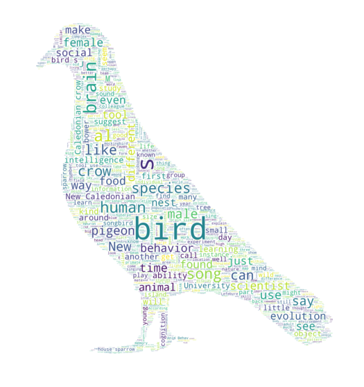

# The Genius of Birds book visual analysis with python

Word Cloud is

## Introduction

## DATA

## Results

## Conclusion

## Reference

[México's presidential speech visual analysis with python by Luis Novelo](https://github.com/PhinanceScientist/AMLO_Wordcloud)

[The Genius of Birds by  Jennifer Ackerman](https://www.jenniferackermanauthor.com/genius-ofbirds)
